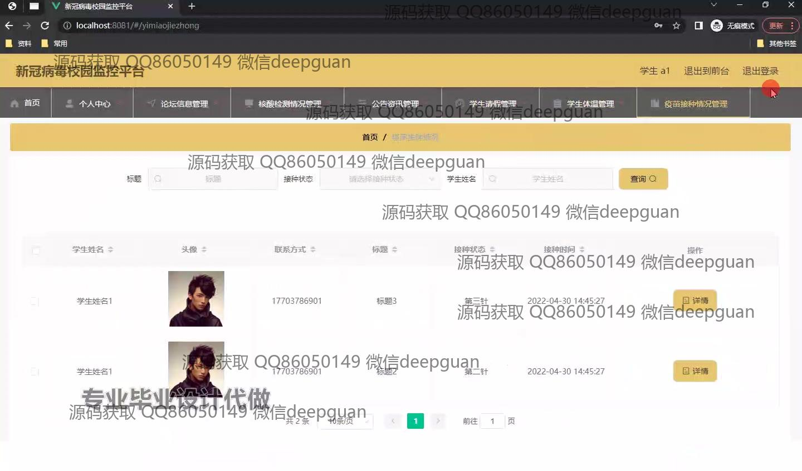

<h1 align="center">新冠病毒校园监控平台的设计与实现+vue</h1>

## 简介
新冠病毒校园监控平台：角色分为管理员、教师、学生；功能包括登录管理、健康数据管理、学生请假管理、论坛信息管理、疫苗接种情况管理、核酸检测管理、公告资讯管理。    --计算机毕业设计源码；毕设源码；java毕业设计源码

## 联系方式

<h3 align="center">获取完整代码与数据库文件 + 微信：deepguan QQ: 86050149 QQ群: 783742310</h3>

<h3 align="center">可帮忙远程部署 包运行成功！提供远程部署、修改代码、设计文档指导、代码讲解等服务！</h3>

## 功能介绍（完整见运行截图）
管理员：可以通过角色选择或用户名密码登录平台，管理系统模块如用户管理、学生请假管理、体温管理、疫苗接种情况等。可对数据进行查询、修改、删除以及新增，也能管理帖子的详情及回复。 面板提供了丰富的管理功能，帮助管理员进行高效的疫情监控和数据管理。

教师：登录后可查看和管理班级内学生的健康数据，提交或审核请假申请，参与论坛信息交流。教师可以通过平台查看学生检测及接种情况，有助于及时掌握学生的健康动态，为学校疫情管理提供支持。

学生：用户登录后可访问个人中心查看接种和检测情况，可以申请请假，参与论坛互动，查看公告资讯和疫情科普知识等。学生可以通过查询功能快速找到相关数据，方便在疫情期间进行自我管理和信息获取。

用户：系统提供静态页面供用户进行角色选定后注册或登录，进入个人中心管理个人资料和信息。用户可以参与到公告资讯、论坛讨论及查看疫情动态，系统也提供注册入口以方便新加入用户。

## 运行截图

本代码来源于网络,仅供学习参考使用!

